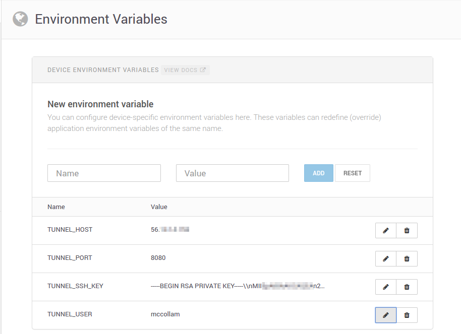
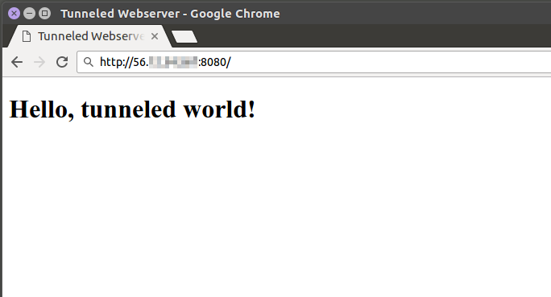
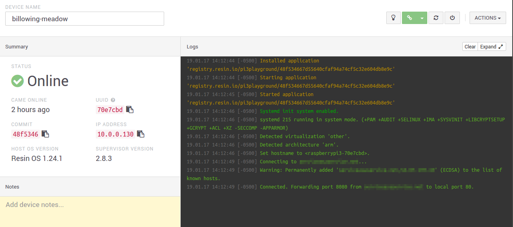

# simple-ssh-tunnel
Example of setting up a reverse ssh tunnel using resin.io

This shows a very simple example of setting up a reverse ssh tunnel within a
resin.io container.

Theory
======
A reverse ssh tunnel can be used to provide connectivity to a device from
outside the local network without needing to allow inbound connectivity (e.g.
opening firewall ports, providing port forwarding, etc.).  It does this by
opening an ssh connection from the device managed by resin.io to a target
machine that is publicly accessible.  This ssh connection then listens for
inbound connections on a given port on the target machine and transparently
forwards them over the open ssh connection.

Configuration
=============
This project uses environment variables to specify the target for the ssh
tunnel, the port to be used, and ssh key and username used to connect to the
internet host.  The port on the device can be optionally specified but will
default to 80 if not set.

Variable       | Status |                Use
--------       | ------                | ---
TUNNEL_HOST    | Required              | Internet-accessible ssh host
TUNNEL_PORT    | Required              | Port to forward from host to device
TUNNEL_USER    | Required              | Username for logging into host
TUNNEL_SSH_KEY | Required              | ssh private key (see below)
DEVICE_PORT    | Optional (default 80) | Target port on device

Including ssh key
-----------------
To populate the ssh private key on the device, copy the contents of the private
key file into the environment variable, replacing newlines with `\\n`.  A quick
way to do this is to run this command and copy the result to the environment
variable:

`cat private_key | awk -F'\n' '{print $1 "\\\\n"}' | tr -d "\n"`

where `private_key` is the key file containing the credentials to use.  The
corresponding public key will need to be in the `authorized_keys` file on the
`$TUNNEL_HOST` system.  (Configuring and managing ssh keys is beyond the scope
of this README.  More information can be found
[online](https://www.cyberciti.biz/faq/how-to-set-up-ssh-keys-on-linux-unix/).)

**NB: DO NOT USE YOUR "DEFAULT" SSH KEY.  DO NOT USE THE SAME KEY ON MULTIPLE
DEVICES.**  You should generate a new ssh key for each device and keep them
separate so that you can revoke access to a device's key in the event it is
compromised.

Use
===
Once the environment variables are filled in, the script should automatically
connect to the `$TUNNEL_HOST` system and begin forwarding a port.  This
example project forwards a port from the internet accessible host to a
webserver running on port 80 on the device.  So if you have used your local
desktop as the `$TUNNEL_HOST` and port 8080 for `$TUNNEL_PORT`, connecting
to `localhost:8080` on your desktop will forward you to port 80 on the
device.

A few console logs are printed to indicate the status of the ssh tunnel as it
is connected.

Bugs
====
Numerous.

This is sample code and does no real error checking, does not reconnect if a
connection is lost, etc.  It is simply to show how a reverse ssh tunnel can
be created inside of a resin.io container.

I hope it is useful as a guide but please make sure you understand what you
are doing and ensure you have proper error handling and security when running
anything in production.
